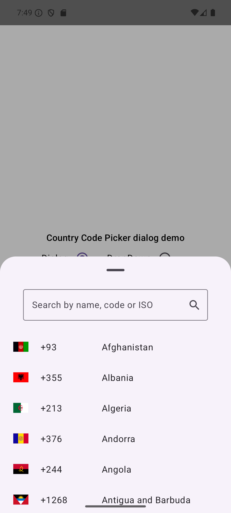

# CountryCodePicker

A Compose Multiplatform library for searching and selecting country codes and ISOs.

## Supported platforms

- Android
- ios
- Desktop
- Web(WasmJs)

## Usage

The library can be used in multiple ways:

1. Using the Country enum. You can use the Country enum to access all it's entries
   and do whatever you want with it, like build your own selector UI or find a specific country.
    ```
   // Enumerate all countries
   Country.entries.forEach { country ->

    }

    // Access country details
    val australia = Country.Australia
    val isoCode: String = australia.iso
    val phoneoCode: String = australia.phoneCode
    val flag: DrawableResource = australia.getFlag()
   ```
2. Use the dialog. The library comes with an adaptive dialog, on smaller screens, a BottomSheet is displayed,
   while on bigger screens, a dialog is shown.
   ```
   CountryCodePickerDialog(onDismiss = { }) { country ->
         selectedCountry = country
     }
   ```
   ### ios
    
   <br>
   <br>
   <br>


   ### Android
   
   <br>
   <br>
   <br>

   ### Desktop
   
   <br>
   <br>
   <br>

   ### Web
   


